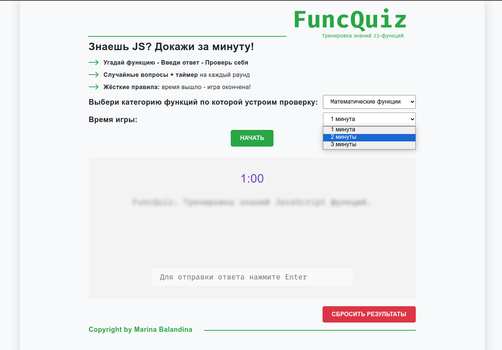
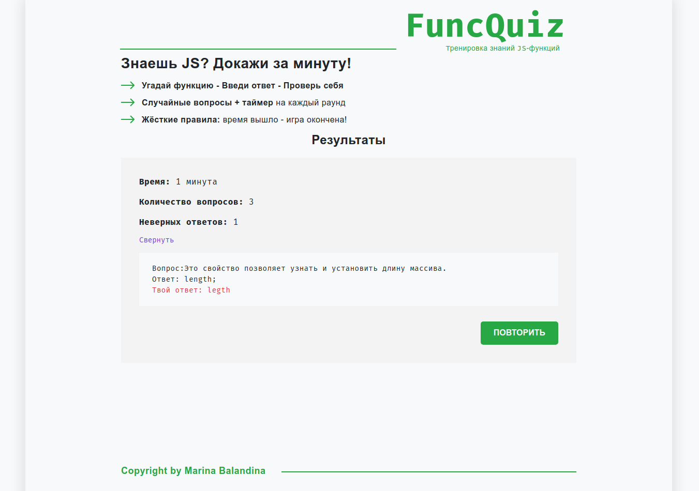

# 🧠 JavaScript Functions Quiz - Тренажер методов JS

[](https://balandinam.github.io/FuncQuiz/)
[](https://github.com/BalandinaM/FuncQuiz)

Интерактивный тренажер для изучения методов JavaScript с системой запоминания прогресса.

## ✨ Особенности
- 🎯 Тренировка распознавания методов по описанию
- ⏳ Таймер на 1/2/3 минуты
- 🗂️ Фильтрация по категориям (строковые, математические и др. методы)
- ⏳ Валидация в реальном времени
- 📊 Статистика ответов после завершения
- 📌 Сохранение прогресса через LocalForage
- 🔄 Сброс статистики

## 🛠 Технологии
- **React 19** (новейшая версия)
- **Redux Toolkit** для управления состоянием
- **React Router** для навигации
- **LocalForage** для оффлайн-хранения данных
- **Vite** для сборки

## 🚀 Как запустить
1. Установите зависимости:

```npm install```

2. Запустите dev-сервер:

```npm run dev```

### Для production-сборки:

```npm run build```

## 📸 Скриншоты




## 📌 Планы по развитию
- Добавить больше категорий методов
- Режим "Сложный уровень" (с ограничением времени на ответ)
- Система достижений
